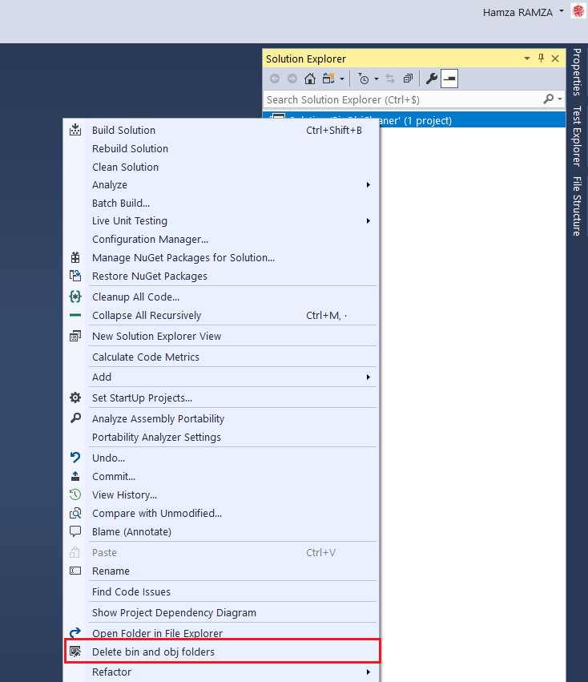
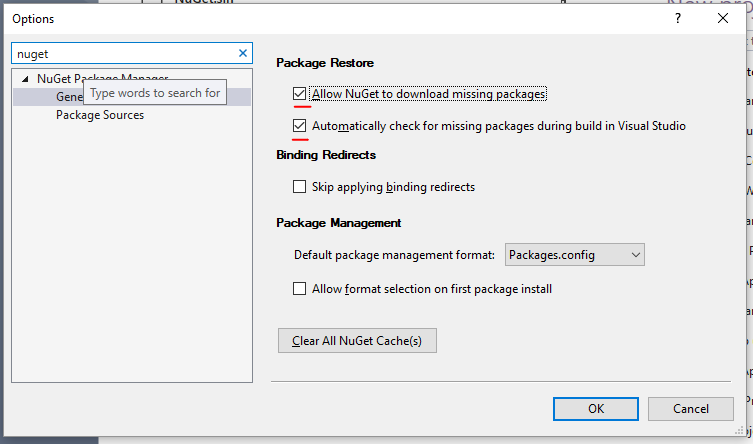

# Delete bin and obj folders extension

Delete obj and bin folders

## How to proceed ?

To proceed, right-click in Solution Explorer and select
**Delete bin and obj folders**

## For .NET CORE projects
In case of a .net core project, the bin & obj folders are deleted but restored in a few seconds because the project system is watching those files through project.assets.json, if it is deleted, the packages are restored, which means that your solution will be rebuilt.
To prevent this, you should disable nuget packahes auto restoring

